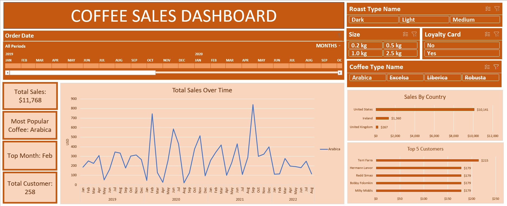
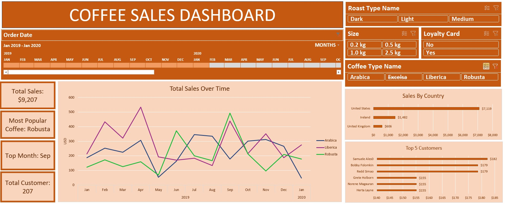

# Coffee Sales Dashboard (Excel)

An interactive Excel dashboard built to explore coffee sales performance across roast type, coffee type, bag size, loyalty status, country, customers, and time.

*Default view — filtered to Arabica, showing Total Sales, Most Popular Coffee, Top Month, and Total Customers as live KPIs.*

## What It Answers

- What is the total sales, and how does it change when slicing by roast type, bag size, or loyalty status?
- Which coffee type and month are driving the most sales?
- How many distinct customers are behind a given filter — not just how many orders?
- Which countries and customers contribute the most revenue?

## Data Source

The raw dataset (`coffeeOrdersRawData.xlsx`) is a multi-sheet workbook with three related tables:
- **orders** — 1,000 order records (order details, dates, product/customer IDs, loyalty card status)
- **customers** — 1,000 customer records (customer ID, country, and related attributes)
- **products** — 48 products, broken out by coffee type, roast type, and bag size, with unit price, price per 100g, and profit

The orders and customers tables are joined on customer ID, and orders/products on product ID, to support the roast type, coffee type, bag size, country, and customer-level analysis in the dashboard.

## Key Features

- **4 live KPI cards** — Total Sales, Most Popular Coffee, Top Month, and Total Customers — that update together based on active filters.
- **5 interactive filters** — Roast Type, Size, Loyalty Card, Coffee Type, and Order Date timeline.
- **Distinct customer counting** — the Total Customers KPI uses a distinct count, so repeat customers are not double-counted when filters change.
- **Sales trend analysis** — explore how sales change over time for individual or multiple coffee types.
- **Sales by Country** — compare sales contribution across countries.
- **Top 5 Customers** — identify customers with the highest sales contribution.

*Filtered view — selecting a specific date range and coffee type updates the KPIs and supporting charts together.*

## How It's Built

- Built using **Excel PivotTables and PivotCharts**.
- Multiple visualizations are connected through **Report Connections**, allowing the same slicers to control different parts of the dashboard.
- KPI cards are created using **cell-linked shapes**, rather than static text, so their values update dynamically.
- A helper column with indexed customer values is used to calculate **distinct customer counts** within the PivotTable-based dashboard.

## Technical Challenges & Solutions

Building the dynamic KPI cards required several rounds of troubleshooting.

- **Dynamic KPI cards:** Shapes need to be linked to cells rather than having values typed directly into them.
- **Distinct customer count:** Excel's standard PivotTable Grand Total can re-sum counts rather than provide a true distinct count. An indexed helper column was therefore used to calculate unique customers correctly under different filters.

## Tools

**Microsoft Excel** — XLOOKUP, INDEXMatch, PivotTables, PivotCharts, Slicers, Timeline, cell-linked shapes, and helper columns.
